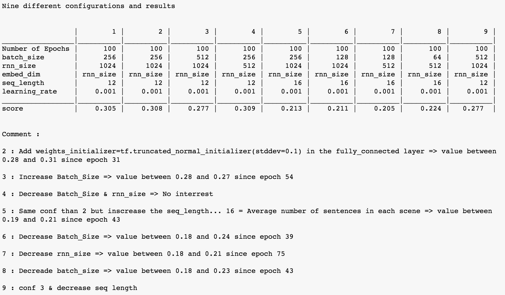

# Udacity Nanodegree Foundation Program

This is the repository of all the projects I will carry out during [Udacity Deep Learning Nanodegree Foundation Program]("https://www.udacity.com/course/deep-learning-nanodegree-foundation--nd101")


## Project 1 -- your first neural network

Using only numpy, we build a neural network from scratch to carry out predictions on daily bike rental ridership.

In this project, you'll get to build a neural network from scratch to carry out a prediction problem on a real dataset! By building a neural network from the ground up, you'll have a much better understanding of gradient descent, backpropagation, and other concepts that are important to know before we move to higher level tools such as Tensorflow. You'll also get to see how to apply these networks to solve real prediction problems!

```
conda create --name dlnd python=3
source activate dlnd
conda install numpy matplotlib pandas jupyter notebook
jupyter notebook DLND\ Your\ first\ neural\ network.ipynb
```


## Project 2 -- Image Classification 

Using TensorFlow, the objectif is to classify Images from [CIFRA-10 dataset]("https://www.cs.toronto.edu/~kriz/cifar.html").

Here is the different steps contained in "the dlnd_image_classification" notebook :
- Get and Explore the data from [CIFRA-10 dataset]("https://www.cs.toronto.edu/~kriz/cifar.html") : The dataset consists of airplanes, automobiles, birds, cats, deers, dogs, frogs, horses, ships end trucks.
- Pre-process functions : Normalizing, One-Hot encoding, No need to randomize the images (the dataset is already randomized)
Normalize the images : 2 solutions using np.linalg.norm => compute the norm of the matrix or divide by 255.

- Build a convolutional layer :
  - **Input** : Implement 3 tensors for the images, the labels and the drop out (neural_net_image_input, neural_net_label_input, neural_net_keep_prob_input)
  - **Apply convolution and max pooling** using `tf.nn.conv2d`, `tf.nn.bias_add`, `tf.nn.relu` and `tf.nn.max_pool`.
  - **Implement the flatten function** to change the dimension of x_tensor from a 4-D tensor to a 2-D tensor using `tf.reshape`.
  - **Then fully connected layer** to x_tensor with the shape (Batch Size, num_outputs). XW + b and apply relu function.
  - **The output layer** : apply a fully connected layer to x_tensor with the shape (Batch Size, num_outputs) without applying activation functions.

**My Convolutional Model**
  - Apply 1, 2, or 3 Convolution and Max Pool layers
  - Apply a Flatten Layer
  - Apply 1, 2, or 3 Fully Connected Layers and Apply TensorFlow's Dropout using keep_prob
  - Apply an Output Layer
  - Return the output

**My Parameters**
- Normalize using 255 (np.linalg.norm)
- conv2d_maxpool => weights stddev = 0.1
- fully_conn => weights stddev = 0.1
- output => weights stddev = 0.1
- conv_net => Play around with different number of outputs, kernel size and stride
- Hyperparameters :
  - epochs = 20
  - batch_size = 128
  - keep_probability = 0.85


## Project 3 -- Generate TV Scripts

In this project, the objective is to generate our own Simpsons TV scripts using RNNs. We'll be using part of the Simpsons dataset of scripts from 27 seasons. The Neural Network we'll build will generate a new TV script for a scene at Moe's Tavern.

### Nine different configurations => final is the 7th



## Project 4 -- Language Translation

In this project, you’re going to take a peek into the realm of neural network machine translation. You’ll be training a sequence to sequence model on a dataset of English and French sentences that can translate new sentences from English to French.

The NN architecture encode-decode is used.

It consists of two RNNs (Recurrent Neural Network) : An Encoder and a Decoder. 
- The encoder takes a sequence(sentence) as input and processes one symbol(word) at each timestep. Its objective is to convert a sequence of symbols into a fixed size feature vector that encodes only the important information in the sequence while losing the unnecessary information.
- Each hidden state influences the next hidden state and the final hidden state can be seen as the summary of the sequence. This state is called the context or thought vector, as it represents the intention of the sequence. 
- From the context, the decoder generates another sequence, one symbol(word) at a time. Here, at each time step, the decoder is influenced by the context and the previously generated symbols.

[Very good article on Seq2Seq](http://suriyadeepan.github.io/2016-06-28-easy-seq2seq/)
